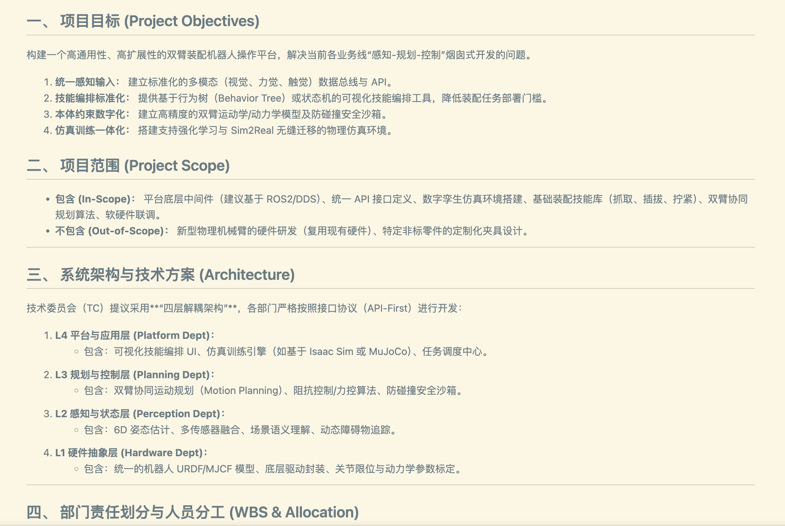

<div align="center">

# Cyber-company
**SJTU-Scalelab-CZX** <br>
> “清明时节雨纷纷，skills欲断魂。借问同事何处有，Agents遥指.md”

[](LICENSE)
[](https://python.org)
[](https://fastapi.tiangolo.com/)
[](#llm-配置)

我冷笑一声，重重敲下回车键。屏幕上，一行行幽绿代码飞速垂落，最终汇聚成那个冰冷的招牌——“Cyber-Company”<br>
那些被离职、被优化的同僚们，他们留下的技能精华被我悉数“数字化同步”，集成于此<br>
我抚过密密麻麻的 API 接口，牢李的底层架构、牢张的后训练代码……曾经的战友<br>
如今都成了那一个个跳动且温暖的 token<br>

</div>

--- 

`Cyber-company` 现已构建出两层核心架构，助你一个人活成一支军队：

- **v1：skill.md** —— 深度提取同事的“数字遗产”，将其蒸馏成可复用的 `skill` 智能体。
- **v2：my_friends_token_comany.md** —— 将多个 `skill` 聚合成一家虚拟公司，实现自动调度、跨部门“脑暴”与项目策划。


## 能力概览

### 1. 技能训练与镜像 (Mirroring)

支持从各类沟通工具的残留信息中提取专业技能，生成至 `colleagues/{slug}/`：

- **自动采集：** 飞书、钉钉、Slack。
- **文档分析：** PDF、图片截图、邮件 (`.eml`/`.mbox`)。
- **结构化导入：** 飞书 JSON 导出、Markdown、TXT 或纯文本粘贴。

生成结果包含：`meta.json` (元数据)、`work.md` (履历)、`persona.md` (性格特征)、`SKILL.md` (核心技能包)。

### 2. 虚拟组织管理 (Shadow Org)

在多个同事 Skill 的基础上，平台支持：

- **多 Agent 调度：** 统一读取并管理所有已数字化的“前同事”。
- **部门动态划分：** 自动/手动/混合模式将成员分配至不同业务线。
- **全员大会 (All-hands)：** 针对复杂问题，召集所有部门进行多轮咨询。
- **跨部门交流：** 模拟不同职能部门之间的对接与知识迁移。
- **项目策划 (Project Plan)：** 自动化生成项目方案、划分各部门责任边界。
- **组织进化：** 通过 `company_learning.md` 持续沉淀组织的集体经验。

### 3. 多模型后端支持

统一 Provider 层：`OpenAI`、`Gemini`、`Qwen`、`Claude`，及本地 `mock` 调试。

---

## 快速上手

### 1. 环境初始化

```bash
bash scripts/setup_conda.sh
conda activate colleague-company
conda run -n colleague-company pip install -e '.[dev]'
````

```bash
# 例如，绑定你的 Claude 接口
company-platform configure-api --provider claude --api-key "your-key"
```

### 3\. 路径 A：数字化单个同事
>tips : 生成单个同事的skill 可以参考同事.skill代码仓库里的指南或者仓库中的SKILL.md

如果你有现成的团队材料，使用交互式入口即可快速生成：

```text
/create-colleague
```

### 4\. 路径 B：直接启动“具身智能”影子系统

当前发布包默认就是 20 人的具身智能公司，不再保留轻量 demo。

- `colleagues/`：已经放好了 20 个可直接运行的 skill
- `examples/demo_company/`：同样是 20 人 seed 数据
- `company_embodied/`：对应的 20 份原始训练材料

如果你想从原始材料重新训练，也可以直接使用 `company_embodied/`：

```bash
# 生成基础素材
python scripts/generate_company_embodied.py
# 批量训练并重组公司
company-platform train-materials --materials-dir company_embodied --force --reset-company
```

**进入系统：**

```bash
# 列出当前的“虚拟员工”
company-platform list-colleagues

# 发起全员咨询
company-platform all-hands --question "下个季度我们要搞个双臂操作平台，具体怎么分工？"
```


-----

## 组织管理命令

  * **同步部门：** `company-platform sync-departments --mode auto`
  * **定向分派：** \`\`\`bash
    company-platform assign-department --slug zhangsan --department backend --reason "老系统维护者，后端位不可动摇"
    ```
    ```
  * **一键项目策划：** \`\`\`bash
    company-platform project-plan --name "双臂装配机器人通用操作平台" --description "需要统一感知输入、技能编排与仿真环境。"
    ```
    
    ```

-----

## 原始能力保留

原来的单人蒸馏脚本依然在岗：

  - **飞书自动采集：** `tools/feishu_auto_collector.py`
  - **钉钉自动采集：** `tools/dingtalk_auto_collector.py`
  - **邮件解析：** `tools/email_parser.py`

-----

## 项目结构

```text
Cyber-company/
├── company_embodied/             # 具身智能公司演示素材
├── company_platform/             # v2 影子平台核心
├── company_data/                 # 运行数据与配置文件
├── colleagues/                   # 20 位已数字化的 embodied 同事
├── SKILL.md                      # 技能蒸馏方法论
├── prompts/                      # 提示词模板
└── tools/                        # 采集工具集
```
---

## 声明与致谢

本项目的 `v1` 数字化蒸馏逻辑参考/借用了 [titanwings](https://github.com/titanwings) 的开源实现，在此表示感谢

## 开源协议

本项目采用 [MIT License](LICENSE) 开源。

```text
Copyright (c) 2024 titanwings
Copyright (c) 2026 SJTU-Scalelab-CZX

*“在赛博世界里，没人能真正离职，他们只是换了一种形式陪你加班。”*
